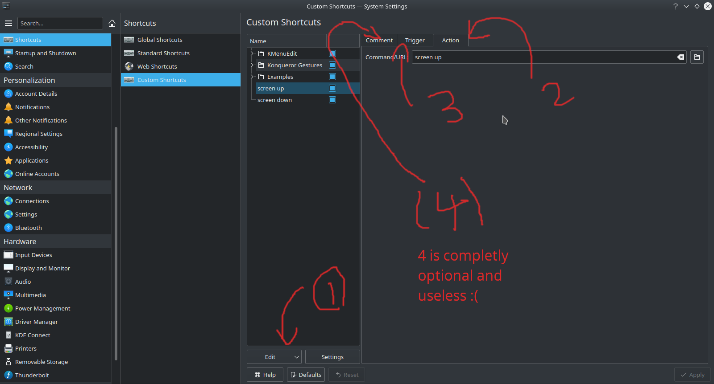

# [External_monitor_brightness](https://github.com/arashph17/External_monitor_brightness)
## Welcome :sunglasses:

External monitor brightness Mangager
<br />
If you add an External monitor and the shortcut key for changing brightness on your laptop doesn't work, then this script will be helpful for you (of course you need to have a GNU/LINUX distribution)

Put 'screen' in the /usr/bin or /bin or any dir in your PATH.
After that you can use:
```
screen up
or
screen down
```
Of course this is not useful enough, We want to add shortcut for that.


### KDE Plasma Desktop
1. Lunch setting
2. Shortcuts tab
3. Custom Shortcuts
4. Edit, New, Global Shortcut, Command/URL
5. add action (once 'screen up' and once again 'screen dow')
6. add you favrite shortcut (in Trigger tab)
7. add comment :neutral_face:
