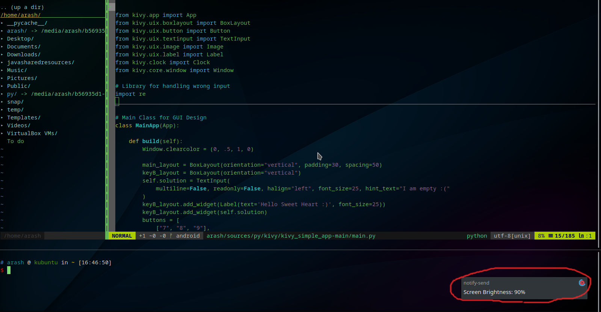

# [Monitor_brightness_Manager](https://github.com/arashph17/External_monitor_brightness)
## Welcome :sunglasses:


### External monitor brightness Manager

If you added an External monitor to your laptop and the shortcut key for changing brightness on your laptop didn't work, then this script will be helpful for you (of course you need to have a GNU/LINUX distribution)

## Requirements
Notify-send and xrandr. <br />
You most likely have notify-send(99%), but if you don't (which you have :neutral_face:) then install that. <br />
```
which notify-send
```
If printed anything, you have that, Ex. /usr/bin/notify-send <br />
Also you have xrandr probably but if you don't: <br />
#### Debian base:
```
sudo apt install xrandr
```
#### RHEL base:
```
sudo dnf install xrandr
```
#### Arch base:
```
sudo pacman install xrandr
```

After that you can use:
```
./screen up
or
./screen down
```
If you see this: <br>
```
bash: permission denied
```
Run:
```
sudo chmod +x screen
```

In the end put 'screen' in /usr/bin or /bin or any dir in your PATH.
```
sudo cp screen /usr/bin
```
Of course this is not useful enough, We want to add shortcut for that.


### KDE Plasma Desktop

1. Lunch setting <br />
2. Shortcuts tab <br />
3. Custom Shortcuts <br />
4. Edit, New, Global Shortcut, Command/URL <br />
5. add action (once 'screen up' and once again 'screen down') <br />
6. add your favrite shortcut (in Trigger tab) <br />
7. add comment :neutral_face:
<br />

### GNOME Desktop
1. Lunch setting <br />
2. Shortcut keyboard tab <br />
3. '+' key in the bottom of shortcut list <br />
4. Command -> 'screen up' or 'screen down' <br />
5. add your favrite shortcut <br />
<br />
Good bye friend
